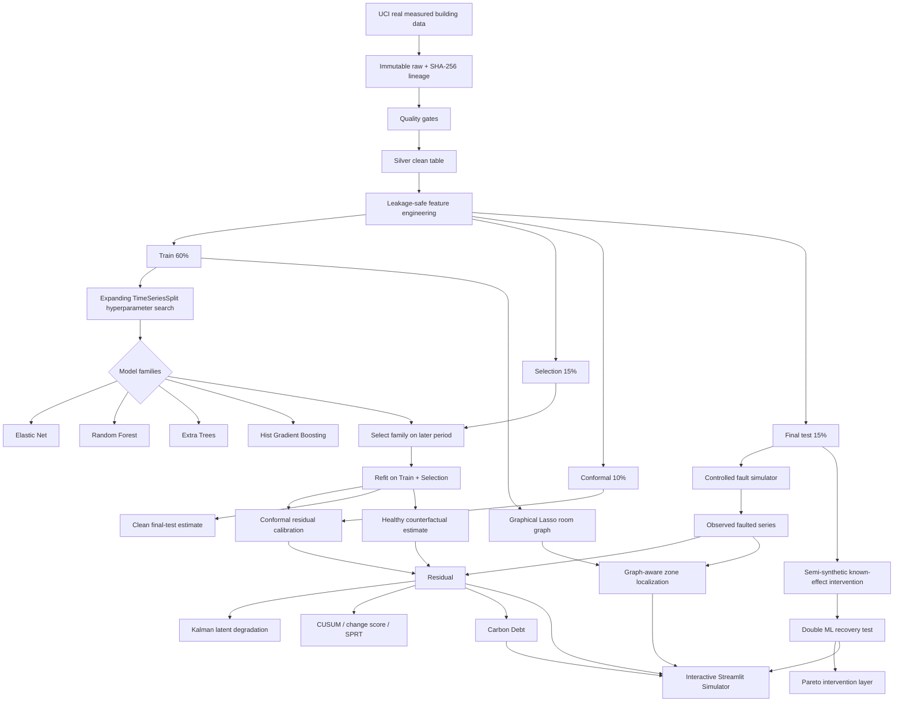

# CarbonTwin-R v0.2 Architecture

## Separation of concerns

### Data truth

The UCI measurements are real. Benchmark faults/interventions are controlled semi-synthetic overlays. The repository keeps these labels separate.

### Model tuning vs fine-tuning

- classical models: hyperparameter tuning with temporal CV;
- neural sequence model: optional pretraining/fine-tuning experiment;
- no method is promoted merely because it is more complex.

### Graph truth

The room graph is learned from training-only conditional dependencies with Graphical Lasso. It is not described as physical BIM topology.

### Carbon truth

The default carbon factor is a configurable scenario factor. It is not described as historical Belgian grid intensity. Users may replace it with a time-indexed emissions series for production accounting.

### Causal truth

Double ML is tested on a known-effect benchmark. Observational feature importance is never presented as causal evidence.
